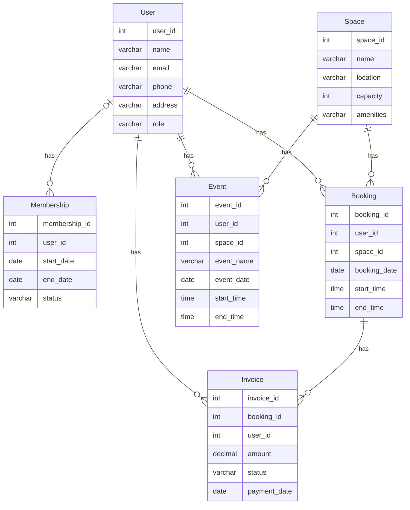

# mermaid ER Diagram

https://mermaid-js.github.io/

https://mermaid-js.github.io/docs/mermaid-live-editor-beta/

https://mermaid.js.org/syntax/entityRelationshipDiagram.html

```mermaid
erDiagram
  User |o--o{ Membership : has
  User ||--o{ Booking : has
  User ||--o{ Invoice : has
  User ||--o{ Event : has
  Space ||--o{ Booking : has
  Space ||--o{ Event : has
  Booking ||--o{ Invoice : has

  User {
    int user_id
    varchar name
    varchar email
    varchar phone
    varchar address
    varchar role
  }

  Membership {
    int membership_id
    int user_id
    date start_date
    date end_date
    varchar status
  }

  Space {
    int space_id
    varchar name
    varchar location
    int capacity
    varchar amenities
  }

  Booking {
    int booking_id
    int user_id
    int space_id
    date booking_date
    time start_time
    time end_time
  }

  Invoice {
    int invoice_id
    int booking_id
    int user_id
    decimal amount
    varchar status
    date payment_date
  }

  Event {
    int event_id
    int user_id
    int space_id
    varchar event_name
    date event_date
    time start_time
    time end_time
  }

```